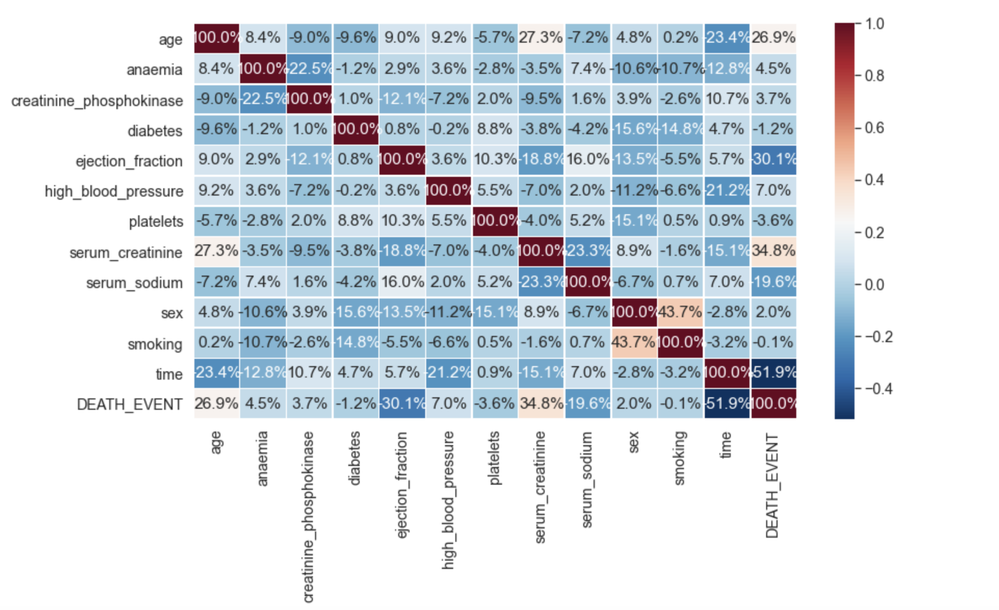

## Heart Failure prediction 

### Context
Cardiovascular diseases kill approximately 17 million people globally every year, and they mainly exhibit as myocardial infarctions and heart failures. 
Heart failure (HF) occurs when the heart cannot pump enough blood to meet the needs of the body. 
Available electronic medical records of patients quantify symptoms, body features, and clinical laboratory test values, 
which can be used to perform biostatistics analysis aimed at highlighting patterns and correlations otherwise undetectable by medical doctors.

People with cardiovascular disease or who are at high cardiovascular risk 
(due to the presence of one or more risk factors such as hypertension, diabetes, hyperlipidaemia or already established disease) 
need early detection and management wherein a machine learning model can be of great help.

The purpose of this project is to develop a machine learning algorithm that can successfully predict heart failure event based on 12 healthy-related metrics.

### About the dataset
This dataset contains 299 entries with 12 features that can be used to predict mortality by heart failure. Some of the features are age, whether a patient is a smoker, 
whether a patient has diabetes or high blood pressure, and so on.

### Kernel content
The kernel is divided into 4 separate parts: 

     1. Import libraries and load the dataset
     2. Exploratory Data Analysis (EDA)
     3. Building prediction model
     4. Model tunning

### Findings
Below are some of the correlation matrix between vairables in the dataset

Looking from the heatmap above, we can observe a couple of intersting points:

* 'sex' and 'smoking' are highly correlated. As it turned out, more male patients smoke than female patients.
* 'age' and 'serum_creatinine' level are remarkably positively correlated to heart failure death rate while 'ejection_fraction' and 'time' are highly negatively correlated to heart failure death rate.

### Modeling
6 different machine learning models were used and compared to predict mortality by heart failure

The best performed model is Random Forest Classifier, with a accuracy score of about 87.5%, followed by XGBoost with 86.1% accuracy.
